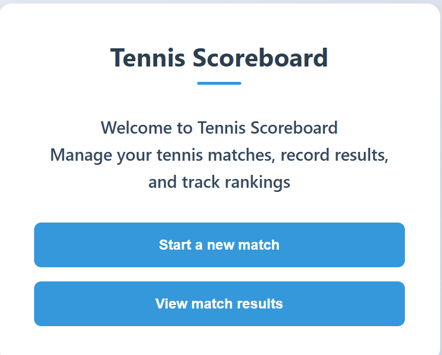
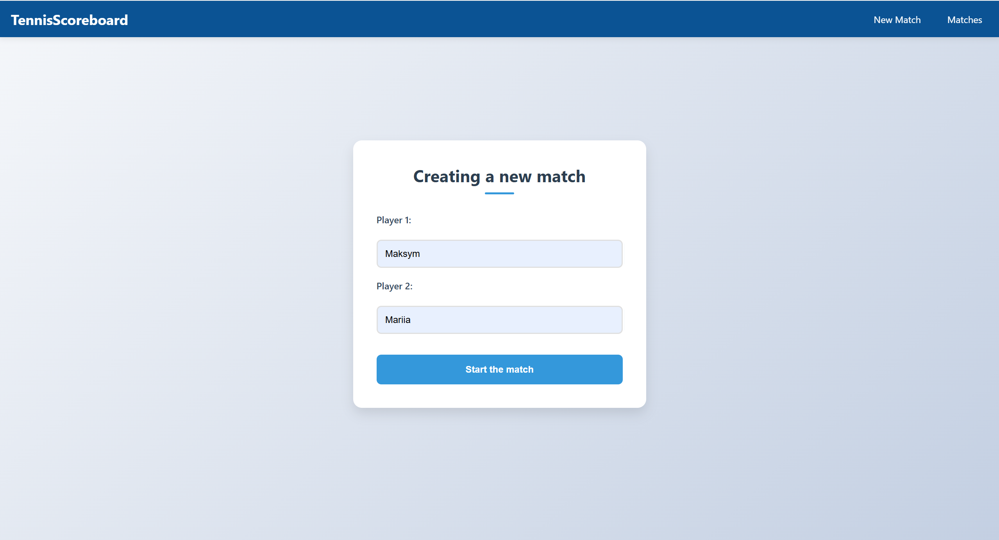
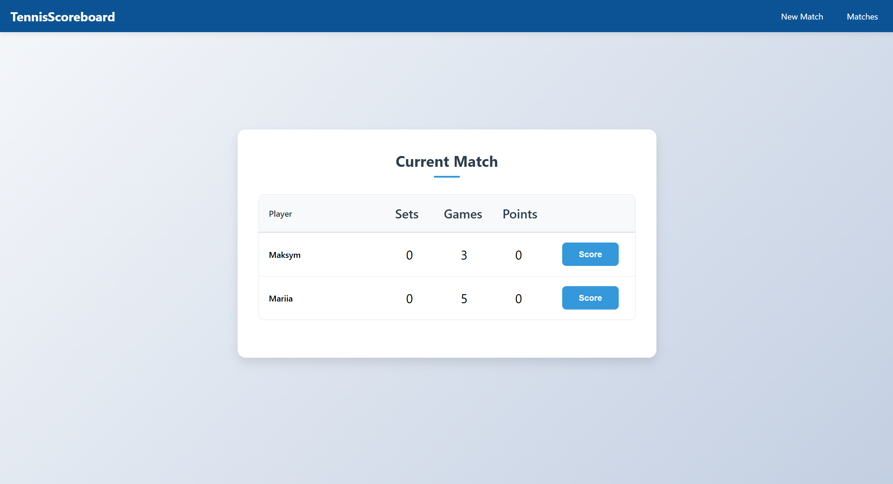
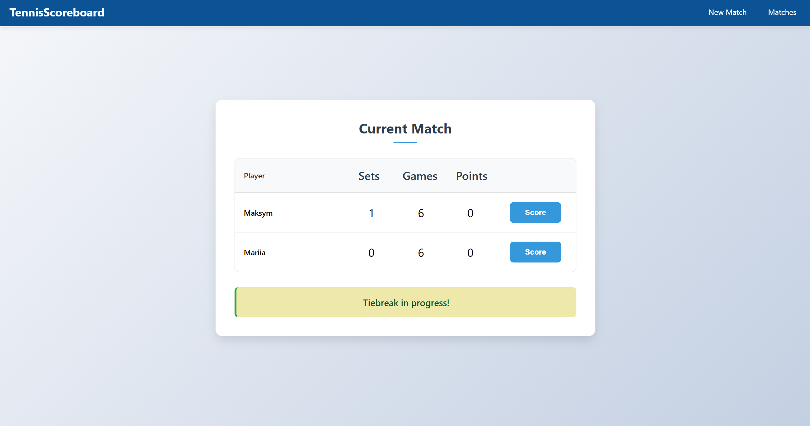
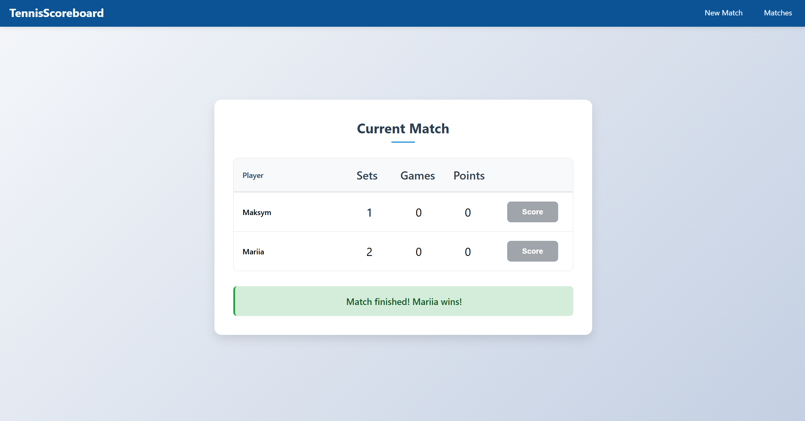
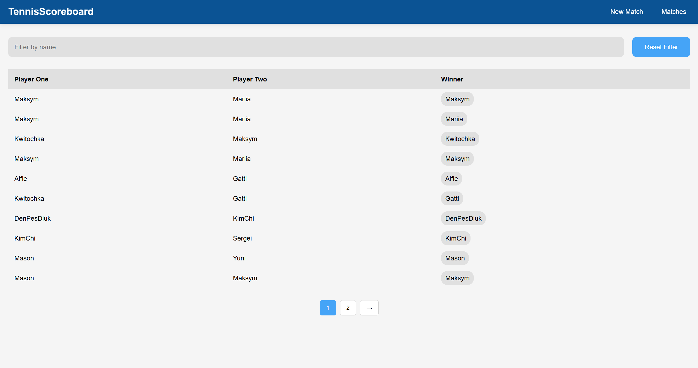

# Tennis Match Scoreboard

This is a web application that implements a tennis match scoreboard, allowing you to track and manage tennis matches through a REST API. 
The application includes functionalities like match creation, score tracking, and a list of finished matches, and uses PostgreSQL as a database, running in a Docker container. 
The front-end is built with HTML, CSS, and JavaScript, and the back-end is implemented in Java (JDK 21) using Hibernate for database management and Maven as the project build tool.

## Project Overview
This project aims to simulate a tennis scoreboard system where you can:

* Create new tennis matches.
* Track the score in real-time.
* View finished matches.
* Search for matches by player name.

## Tech Stack
* Back-end: Java (Servlets), Hibernate (ORM for database management), PostgreSQL (running in Docker)
* Database: PostgreSQL
* Front-end: HTML, CSS, JavaScript
* Build tool: Maven
* REST API: The application communicates through HTTP requests (GET, POST)
* Database Management: Hibernate for ORM
* Docker: Used to run the PostgreSQL database in a container

## Functionality
### Match Management
* Create a New Match: Allows creating a match between two players.
* Track Score: As points are won, the score of the match is updated and displayed in real-time.
* Finished Matches: Stores completed matches in the database and allows viewing a list of finished matches.
### Match Scoring System
* The tennis match is played according to best of 3 sets.
* Tie-break: If the score reaches 6-6 in a set, a tie-break is played to 7 points.

## Key Pages

#### New Match Page (/api/new-match)
* A form to input Player 1 and Player 2 names and start the match.
#### Match Score Page (/api/match-score?uuid=$match_id)
* Displays the names of the players and the current score.
* Allows updating the score when a player wins a point.
#### Finished Matches Page (/api/matches)
* Displays a list of finished matches, paginated, and allows filtering by player name.

## Testing
The project includes unit tests using JUnit 5, covering cases like:
* Scoring points and determining game winners.
* Handling tie-break scenarios.
* Validating match results.

## Overview

### `Start page`

___

### `Player Creation Page`

___ 

### `Score Calculation Page for Players`

___

### `Score Calculation Page during Tiebreak`

___

### `Match Finished - Winner Displayed`

___

### `Completed Matches`

---

